# 1DV018 – Inlämning 1: Rapport

Kod: `part1.py` (Del 1) och `part2.py` (Del 2). Alla experiment körs automatiskt via
`main()` när respektive fil körs (`python part1.py` / `python part2.py`).
Bilderna som visas nedan ligger i mappen `Pictures/`.

---

## Del 1 – Three-Sum

### 1. Genomförande av experimenten

Jag implementerade två varianter av 3-sum-problemet (alltid med `sum = 0`):

- **`threesum_brute(lst, sum=0)`** – bruteforce med tre nästlade loopar
  (`i < j < k`). Varje giltig trippel sorteras och läggs i ett `set`, så att
  t.ex. `(3, 0, -3)` och `(-3, 3, 0)` räknas som samma lösning.
- **`threesum_pointer(lst, sum=0)`** – sorterar listan och använder sedan
  two-pointer-tekniken (se punkt 4).

Slumplistor genereras med `random_list(n)`, som drar `n` heltal i intervallet
`[-10n, 10n]`, precis som uppgiften anger.

**Korrekthetstest (deluppgift c):** Tre slumplistor av storlek 15 skrevs ut
tillsammans med sina trippellösningar:

```
Input: [24, -146, 25, 73, -74, -36, -69, 91, 115, 90, 49, 27, -111, 36, 103]
Result: [(-74, 25, 49)]

Input: [-111, -21, -117, 122, -145, 51, 147, 52, -137, -55, -55, 54, 63, 49, -84]
Result: [(-117, 54, 63)]

Input: [8, -116, -77, -40, -77, -128, -100, 1, -133, 46, -56, -83, 16, -60, 13]
Result: []
```

Utöver detta jämförde jag `threesum_brute` och `threesum_pointer` mot varandra
på hundratals slumplistor av varierande storlek, och båda gav alltid identiskt
resultat, samt lämnade indatalistan oförändrad.

**Tidsmätning:** Jag mätte körtid med `time.perf_counter()` runt varje
algoritmanrop. Eftersom brute force (O(n³)) och pointer (O(n²)) skiljer sig
kraftigt i hastighet användes olika storleksintervall för att hamna inom
ca 0,1–5 sekunder:

| Algoritm | Storlekar (`n`) | Antal storlekar |
|---|---|---|
| `threesum_brute` | 200 – 690, steg 35 | 15 |
| `threesum_pointer` | 2000 – 10400, steg 600 | 15 |

För varje storlek kördes algoritmen **3 gånger** på nya slumplistor och
medelvärdet användes för analysen.

### 2. Resultat och jämförelse

**Brute force**

| Figur 1 (3 körningar) | Figur 1a (medelvärde) |
|---|---|
| 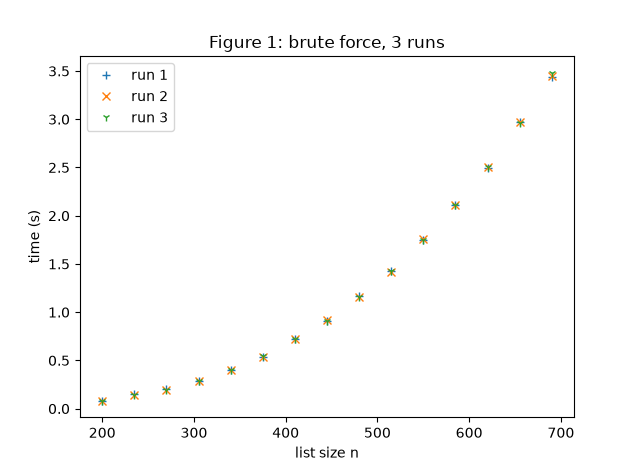 | 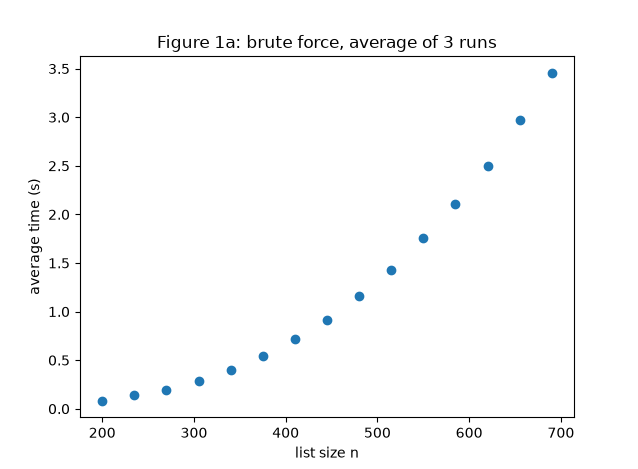 |

De tre körningarna ligger tätt intill varandra, vilket visar att resultatet
gav ungefär samma tider mellan körningar. Tiden växer snabbt: från under
0,1 s vid n=200 till knappt 4 s vid n=690.

**Pointer**

| Figur 1 (3 körningar) | Figur 1a (medelvärde) |
|---|---|
| 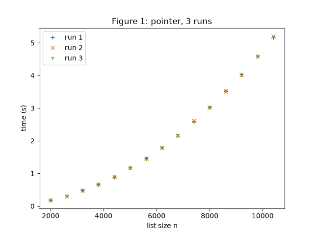 | 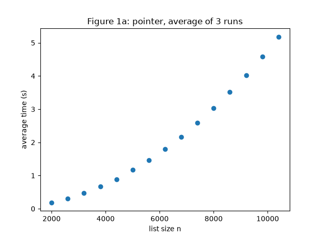 |

Samma mönster här: liten spridning mellan körningarna. Pointer
klarar av mycket större listor (upp till 10 400 element) inom samma tidsram
som brute force klarade av knappt 700 element, det visar tydligt
skillnaden mellan O(n³) och O(n²).

### 3. Matematisk bakgrund

För att uppskatta tidskomplexiteten antog jag att körtiden följer en
potensfunktion `T(n) = c · n^k`. Genom att ta `log2` av båda sidor fick jag fram

```
log2(T(n)) = log2(c) + k · log2(n)
```

vilket är en rät linje `y = m + k·x` med `x = log2(n)`, `y = log2(T(n))` och
`m = log2(c)`. Genom att anpassa en rät linje till de log-transformerade
mätpunkterna kan man alltså läsa av exponenten `k` direkt som linjens
lutning.

`lin_reg(x, y)` beräknar `m` och `k` med minsta-kvadratmetoden:

```
k = (n·Σxy − Σx·Σy) / (n·Σx² − (Σx)²)
m = (Σy − k·Σx) / n
```

Resultatet, med linjär anpassning ovanpå log-log-datan:

| Brute force | Pointer |
|---|---|
| 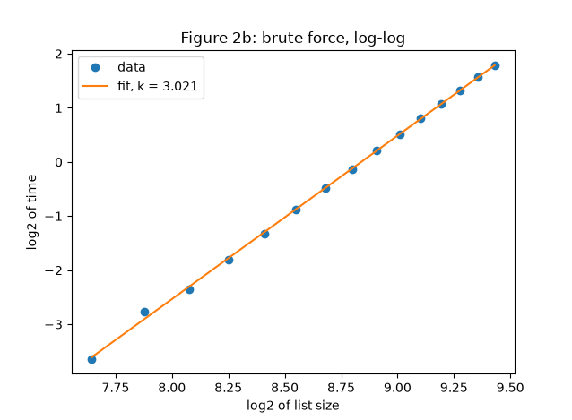 | 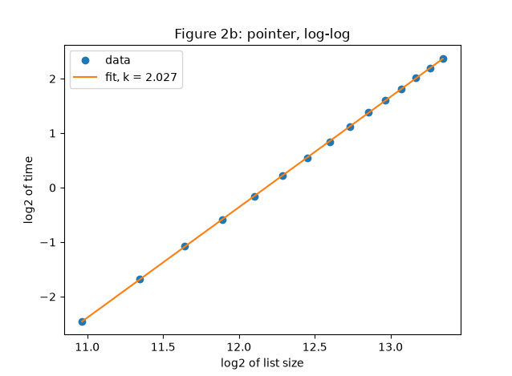 |

- **Brute force: k = 3,021** → mycket nära 3, vilket stämmer med att
  algoritmen har tre nästlade loopar, alltså O(n³).
- **Pointer: k = 2,027** → nära 2, vilket stämmer med att algoritmen sorterar
  listan (O(n log n)) och sedan gör en dubbel loop (yttre loop över `i`,
  inre `while` med två pekare), där den dubbla loopen dominerar för stora
  `n`, alltså totalt O(n²).

### 4. Hur pointer-lösningen fungerar

`threesum_pointer` bygger på att listan först **sorteras**. Sedan fixeras ett
tal `data[i]` i taget och man letar efter två andra tal som tillsammans med
`data[i]` summerar till `sum`, med hjälp av två pekare:

- `lo` startar direkt efter `i`.
- `hi` startar sist i listan.

I varje steg jämförs `data[i] + data[lo] + data[hi]` med `sum`:

- **Om summan är för liten** flyttas `lo` ett steg åt höger (mot ett större
  tal), eftersom listan är sorterad och nästa tal alltid är större eller
  lika.
- **Om summan är för stor** flyttas `hi` ett steg åt vänster (mot ett mindre
  tal).
- **Om summan stämmer** sparas tripeln, och båda pekarna flyttas ett steg
  (för att hitta fler, unika lösningar).

Loopen fortsätter tills `lo` och `hi` möts. Eftersom varje pekare bara rör
sig i en riktning och aldrig passerar den andra, tar det högst O(n) steg per
val av `i`, vilket ger O(n²) totalt (plus O(n log n) för sorteringen, som
försvinner i jämförelse med n² för stora `n`). Det är därför pointer-lösningen
är betydligt snabbare än bruteforce-varianten som testar alla möjliga
kombinationer av tre element utan att utnyttja att listan kan sorteras.

---

## Del 2 – Sorteringsalgoritmer

### 1. Genomförande av experimenten

Jag implementerade sex sorteringsalgoritmer i tre grupper, samtliga returnerar
en ny sorterad lista utan att ändra indatan:

- **O(n²):** Selection sort, Bubble sort, Insertion sort
- **O(n log n):** Merge sort, Quick sort
- **Specialfall:** Bucket sort, Radix sort

Alla algoritmer testades mot Pythons inbyggda `sorted()` på 200 slumpade
listor vardera (storlekar 0–50, för att även täcka tomma listor och listor
med ett element), samt kontrollerades att indatalistan aldrig ändrades.
Radix sort kräver positiva heltal eller 0 (den bygger på att plocka ut siffror
med `//` och `%`), så den testades och mättes med en egen generator
(`random_list_positive`) som bara ger tal ≥ 0, medan övriga algoritmer
använder `random_list` (`[-10n, 10n]`).

Tidsmätningen byggde på samma princip som i Del 1: `time_once` mäter en
körning, `measure_avg` tar medelvärdet av 3 körningar per storlek. Eftersom
de tre grupperna skiljer sig kraftigt i hastighet användes tre olika
storleksintervall för att hamna inom ca 0,1–5 sekunder:

| Grupp | Storlekar (`n`) | Antal storlekar |
|---|---|---|
| O(n²) | 2000 – 11 800, steg 700 | 15 |
| O(n log n) | 150 000 – 1 550 000, steg 100 000 | 15 |
| Specialfall (jämfört med merge/quick) | 200 000 – 1 600 000, steg 100 000 | 15 |

### 2. Resultat och jämförelse

**O(n²): Selection, Bubble, Insertion**

| Körtider | Log-log |
|---|---|
| 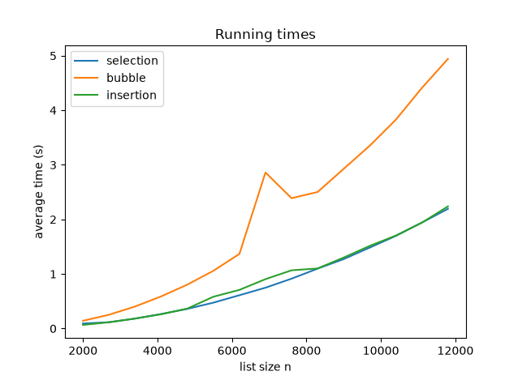 | 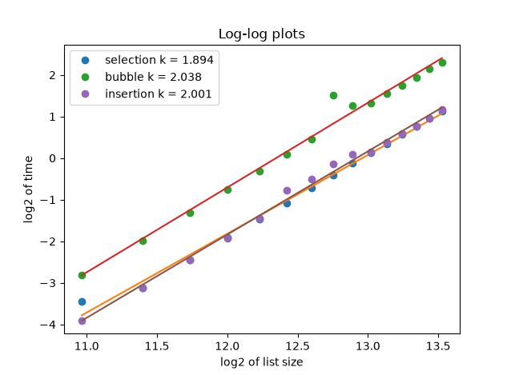 |

Bubble sort är långsammast av de tre (störst konstant, eftersom den
kan behöva byta plats på element många gånger per varv), medan Selection och
Insertion sort ligger nära varandra. Vid den största storleken (n=11 800) tog
Bubble sort ca 5 s, medan de andra två låg på ca 2,3 s.

**O(n log n): Merge, Quick**

| Körtider | Log-log |
|---|---|
| 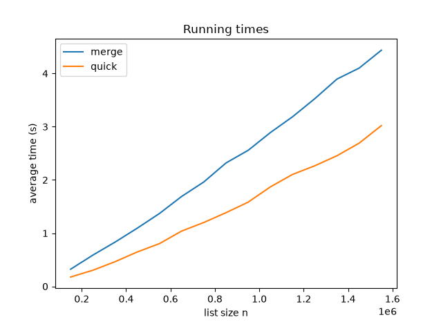 | 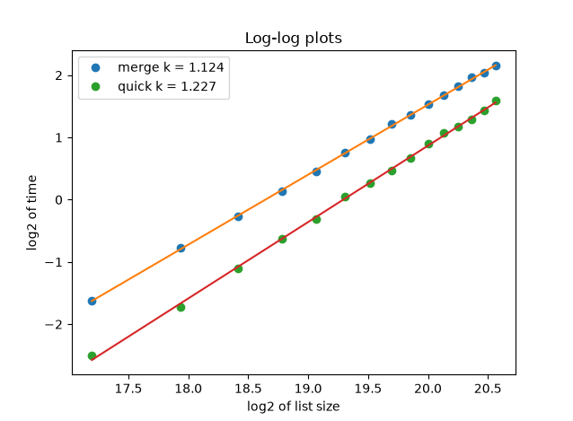 |

I mina mätningar var Quick sort alltid snabbare än Merge sort på slumpad data, trots att
båda är O(n log n). Det beror på att Merge sort behöver extra minne och
kopiering av data vid varje sammanslagning (`merge`), medan Quick sort kan
göra sin uppdelning med enklare listoperationer och har normalt lägre
konstant i praktiken.

**Specialfall: Bucket, Radix jämfört med Merge, Quick**

| Körtider | Log-log |
|---|---|
| 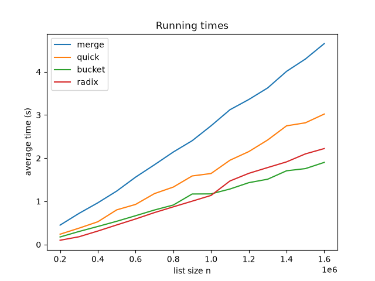 | 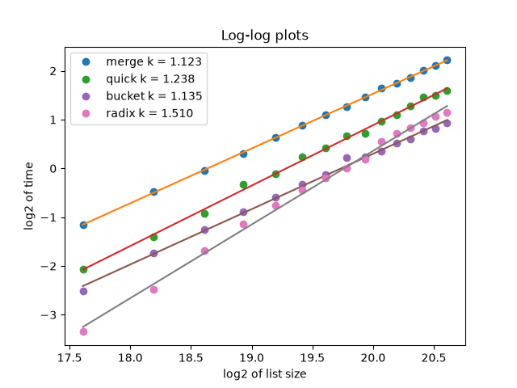 |

Vid mindre listor är Radix sort snabbast men Bucket sort blir snabbare
för större listor (över ca n = 1 000 000). Båda är dock tydligt snabbare
än Merge och Quick sort vid alla testade storlekar. Det stämmer med att
Bucket och Radix sort utnyttjar kunskap om datans struktur (jämnt fördelade
heltal inom ett känt intervall) för att undvika jämförelser mellan element,
något som Merge och Quick sort inte klarar av eftersom de är byggda för att fungera på all sorts data.


### 3. Matematisk bakgrund

Samma metod som i Del 1 användes: `log2` av storlek och tid, och
`lin_reg` för att skatta lutningen `k` i `log2(T(n)) = log2(c) + k·log2(n)`.

| Algoritm | k |
|---|---|
| Selection sort | 2,025 |
| Bubble sort | 2,007 |
| Insertion sort | 1,989 |
| Merge sort | 1,123–1,124 |
| Quick sort | 1,227–1,238 |
| Bucket sort | 1,135 |
| Radix sort | 1,510 |

De tre O(n²)-algoritmerna ger k mycket nära 2, precis som förväntat.

För Merge och Quick sort blir k inte exakt 1, trots att man kanske
förväntar sig det för "n log n". Anledningen är att O(n log n) **inte** är
en ren potensfunktion `n^k`, utan en produkt av `n` och den långsamt
växande faktorn `log(n)`. Log-log-regression fungerar perfekt för rena
potensfunktioner, men ger här en lutning som ligger strax över 1 (eftersom
`log(n)` bidrar lite extra växt när `n` ökar), men det betyder inte att det är
fel. k ≈ 1,1–1,2 ligger fortfarande långt under O(n²)-algoritmernas k ≈ 2,
vilket bekräftar att **Merge och Quick sort** är betydligt närmare linjär tid.

Bucket sort får k = 1,135, nära 1, vilket stämmer bra med att den i
praktiken är O(n) när talen är jämnt fördelade (vilket slumptalen är).
Radix sort får klart högre k (1,510). Det beror på att radix sorts
komplexitet egentligen är O(d·n), där `d` är antalet siffror i de största
talen. Eftersom `random_list_positive` genererar tal upp till `10·n` växer
`d` i takt med att `n` ökar vilket gör att radix sort tar mer tid per
element ju större listan blir. Det syns även i Figur 5: Radix sort är
snabbast vid små listor (lågt `d`) men Bucket sort går om den när
listorna blir stora, eftersom Bucket sorts k ligger närmare 1.

### 4. Hur varje sorteringsalgoritm fungerar

**Selection sort** delar listan i en sorterad del (i början) och en
osorterad del. I varje steg letar den upp det **minsta** elementet i den
osorterade delen och byter plats på det med det första osorterade
elementet, tills hela listan är genomgången.

**Bubble sort** går upprepade gånger igenom listan och jämför **grannpar**.
Om ett par står i fel ordning byts de. Efter varje helt varv har det
största kvarvarande elementet "bubblat" till sin rätta plats längst bak,
så nästa varv behöver gå en position kortare.

**Insertion sort** bygger upp en sorterad del i början av listan, ett
element i taget. Varje nytt element flyttas bakåt genom den sorterade delen
(genom att skjuta undan större element) tills det hamnar på rätt plats,
ungefär som att sortera spelkort i handen.

**Merge sort** är rekursiv: listan delas i två halvor, varje halva sorteras
genom att göra exakt samma sak (rekursion) tills delarna bara har 0 eller 1
element kvar (redan sorterade) och sedan slås de sorterade halvorna ihop
(`merge`) genom att alltid plocka det minsta av de två "främsta" elementen
tills en av halvorna tar slut.

**Quick sort** är också rekursiv: ett element väljs som **pivot** (i min
implementation det sista elementet) och resten av listan delas i två
grupper, de element som är mindre än pivot och de som är större eller lika.
Varje grupp sorteras rekursivt, och resultatet sätts ihop som
`sorterad(mindre) + [pivot] + sorterad(större)`.

**Bucket sort** utnyttjar att talen är jämnt spridda inom ett känt
intervall. Talen delas in i ett antal "hinkar" baserat på sitt värde
(t.ex. hink 0 för de lägsta talen, sista hinken för de högsta). Varje hink
sorteras för sig med en enklare algoritm (jag använde Insertion sort), och
hinkarna slås sedan ihop i ordning.

**Radix sort** sorterar heltal **en siffra i taget:** ental, tiotal, hundratal, osv. I varje pass fördelas
talen i 10 hinkar (en per siffra 0–9) baserat på den aktuella siffran och
hinkarna samlas ihop i ordning **utan** att sortera dem internt. Det här fungerar eftersom ordningen inom varje hink alltid bevaras från föregående pass (kallas att sorteringen är stabil). När alla pass är klara, ända upp till sista siffran i det största talet, är hela listan sorterad.
